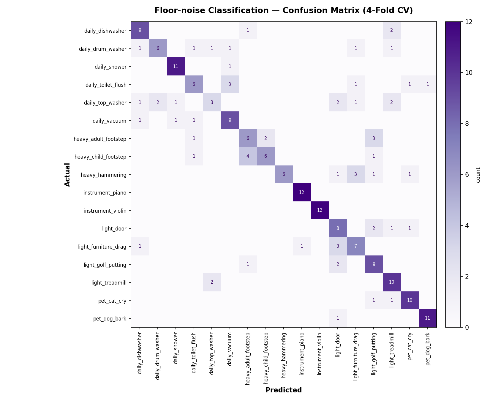

# quiet_log 층간소음 분류 + 데시벨 측정 모델 (POC)

quiet_log 앱의 데모 데이터를 대체하기 위한 첫 단계로, **층간소음(inter-floor noise) 17종 분류 모델**과
**데시벨(dB) 측정 로직**을 만든 프로토타입입니다. 국립환경과학원(AI Hub) "생활환경소음 AI학습용 데이터"의
Validation 세트 중 층간소음(A) 카테고리에서 클래스당 12개씩 샘플을 뽑아 학습했습니다.

## 왜 이 정도 규모인가

전체 데이터셋은 Training만 수십 GB 규모라 이 환경에서 전부 내려받아 학습하는 건 현실적이지 않았습니다.
그래서 먼저 **층간소음 카테고리 17종만, 클래스당 12개 샘플**로 파이프라인 전체(데이터 처리 → 특징 추출 →
학습 → 평가 → API 연동)가 실제로 동작하는지 검증하는 POC로 좁혔습니다. 결과가 괜찮으면 같은 파이프라인에
Training 세트의 더 많은 샘플을 넣어 정확도를 끌어올리고, 이후 공사장/사업장/교통소음 카테고리로 확장하면 됩니다.

## 결과 요약

- **17개 클래스, 4-Fold 교차검증 정확도: 69.1%** (무작위 추측 기준 5.9%)
- 바이올린(100%), 피아노(96%), 강아지(92%), 샤워물소리(85%)처럼 소리 특성이 뚜렷한 클래스는 잘 구분됨
- 통돌이세탁기(33%), 문 여닫는 소리(55%), 화장실 물 내리는 소리(55%)처럼 서로 비슷한 "물/기계 소리" 계열은
  혼동이 많음 → 샘플을 늘리거나 특징을 보강하면 개선 여지가 큼
- 자세한 클래스별 지표: `cv_report.txt`, 혼동행렬: `confusion_matrix.png` / `confusion_matrix.csv`



## 폴더 구성

| 파일 | 역할 |
|---|---|
| `extract_features.py` | wav 파일 → MFCC/스펙트럴 특징 + dBFS 계산, `features.csv` 생성 |
| `train.py` | RandomForest 학습 + 4-Fold 교차검증, `noise_classifier.joblib` 저장 |
| `plot_confusion.py` | 혼동행렬 이미지 생성 |
| `api.py` | FastAPI 추론 서버 (`/classify`) — quiet_log가 호출할 엔드포인트 |
| `decibel_reference.js` | Expo/React Native용 데시벨 계산 참고 코드 |
| `noise_classifier.joblib` | 학습된 모델 (RandomForest + LabelEncoder + 특징 컬럼 목록) |
| `features.csv`, `confusion_matrix.csv`, `cv_report.txt` | 학습 데이터/평가 결과 |

## 분류 대상 17종 (층간소음)

중량충격음(어른 발걸음, 아이들 발걸음, 망치질) · 경량충격음(가구 끄는 소리, 문 여닫는 소리, 런닝머신,
골프 퍼팅) · 생활소음(화장실 물, 샤워 물, 드럼세탁기, 통돌이세탁기, 진공청소기, 식기세척기) ·
악기(바이올린, 피아노) · 애완동물(강아지, 고양이)

## 데시벨(dB) 측정 방식

실시간 원본 오디오에서 RMS를 구해 `20 * log10(rms)`로 dBFS(풀스케일 대비 상대 데시벨)를 계산합니다.
**dBFS는 실제 소음계가 측정하는 dB(A) SPL과 다릅니다** — 기기·마이크마다 감도가 달라서, 진짜 데시벨처럼
보여주려면 실제 소음계로 몇 개 기준점을 재서 보정 오프셋을 구해야 합니다 (`decibel_reference.js`의
`dbfsToApproxSpl` 참고). quiet_log 앱에서는 굳이 이 계산을 직접 구현하지 않아도, `expo-av`의
`Audio.Recording`이 `isMeteringEnabled`로 이미 dBFS 값을 실시간으로 주기 때문에 그걸 그대로 쓰는 게
가장 간단합니다 (`decibel_reference.js` 상단 방법 A 참고).

## quiet_log에 연동하는 방법

React Native(Expo)에서 sklearn 모델을 직접 돌릴 수는 없어서, 다음 구조를 권장합니다.

```
[Expo 앱] --(1) 실시간 dB: expo-av metering 그대로 사용
         --(2) 소음 종류: 녹음 파일을 FastAPI 서버로 POST
                    └─ api.py의 /classify 가 dBFS + 분류 top-3 를 JSON으로 반환
```

1. `uvicorn api:app --host 0.0.0.0 --port 8000` 로 서버 실행 (Cloudflare Workers는 Python 실행이
   안 되므로, 별도의 작은 Python 서버가 필요합니다 — Fly.io, Railway, 또는 자체 VM 등에 배포)
2. quiet_log 앱에서 녹음이 끝나면 wav 파일을 이 서버의 `/classify`로 `multipart/form-data`로 전송
3. 응답의 `decibel.dbfs_mean`으로 소음 크기를, `classification.top1.label_ko`로 소음 종류를 화면에 표시
4. 데모 초대 코드(APT-2026 등) 로직은 그대로 두고, 데모 데이터가 채워지던 자리를 이 응답 값으로 교체

## 재현 방법

```bash
pip install -r requirements.txt
tar -xzf data_raw_floor_noise_samples.tar.gz   # data_raw/<카테고리>/*.wav 압축 해제
python extract_features.py
python train.py
python plot_confusion.py
uvicorn api:app --reload
```

`data_raw_floor_noise_samples.tar.gz`에는 AI Hub Validation 세트의 층간소음 17개 카테고리에서
카테고리당 12개씩 뽑은 wav 샘플(총 204개, 약 296MB)이 들어 있습니다.

## 한계 및 다음 단계

- 클래스당 12개 샘플은 매우 적어서, 정확도는 "파이프라인이 동작한다"는 걸 보여주는 수준입니다.
  Training 세트에서 더 많은 샘플을 같은 방식으로 추가하면 정확도가 오를 가능성이 높습니다.
- 데시벨은 dBFS 기준이라 실제 SPL(dB(A))로 쓰려면 소음계로 보정이 필요합니다.
- 다음 단계로 공사장·사업장·교통소음 카테고리를 추가해 전체 4대분류를 커버할 수 있습니다.
